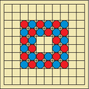
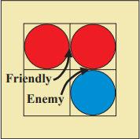
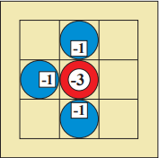
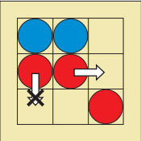

# PFL 2021 2022 - Tabalho Prático 2

## 1. Identificação do trabalho e do grupo

- Jogo: Jostle
- Turma: 7
- Grupo: Jostle_1

| Nome | Número | Contribuição |
| -- | -- | -- |
| Diogo André Barbosa Nunes | up201808546 | x% |
| Margarida Alves Pinho | up201704599 | y% |

## 2. Instalação e Execução
- Install and Execute SICStus
- Consult ```jostle.pl``` file
- Type ```play.```
- Play! :)

## 3. Descrição do Jogo (até 350 palavras) (exceptuando links e imagens, 287 palavras)
Jostle é um jogo para 2 jogadores que usa um tabuleiro 10x10 com 16 peças (já inicialmente dispostas no tabuleiro) para cada jogador (Azul e Vermelho). Cada jogada consiste em mover 1 das peças do próprio jogador e não é permitido passar. A primeira jogada pertence sempre ao jogador Vermelho.



O objetivo do jogo é ser o último jogador a realizar uma jogada válida. Quando um jogador tiver que jogar e não tiver movimentos possíveis de realizar, perde (não há empates nem captura de peças).

Para este jogo é importante esclarecer alguns conceitos para melhor entender o seu funcionamento:
- **Conexão**: existe quando 2 peças estão ortogonalmente adjacentes, quer sejam amigáveis (próprias peças) ou inimigas.
- **Conexão amigável**: conexão com uma peça amigável.
- **Conexão inimiga**: conexão com uma peça inimiga.



- **Valor de uma peça**: número de conexões amigáveis menos o número de conexões inimigas.



Agora que sabemos estes conceitos, podemos facilmente descrever os movimentos possíveis: uma peça só se pode mover para posições livres e ortogonalmente adjacentes, **desde que o seu valor aumente**. No exemplo seguinte, podemos notar que a peça Vermelha central pode ser movida para a direita, uma vez que aumenta o seu valor de 0 (1 conexão amigável e 1 conexão inimiga) para 1 (apenas 1 conexão amigável). Por outro lado, a peça Vermelha mais à esquerda não pode realizar o movimento descrito, pois manteria o seu valor: de 1 conexão de cada tipo passaria a ter 0 conexões, mantendo o valor de 0.



Assim sendo, cada peça poderá ter até 4 conexões. Existe uma variante deste jogo chamada "Hex Jostle", onde as principais diferenças são o tabuleiro hexagonal e o número máximo de conexões possíveis (6).

Ficam aqui 2 links com informação útil sobre Jostle:
- [Link Oficial](http://www.marksteeregames.com/Jostle_Go_rules.pdf)
- [Board Game Peek](https://boardgamegeek.com/boardgame/68808/jostle)

## 4. Lógica do Jogo
descrever (não basta copiar código fonte) o projeto e implementação da lógica do  jogo  em  Prolog.  O  predicado  de  início  de  jogo  deve  ser  play/0.  Esta  secção  deve  ter 
informação sobre os seguintes tópicos (até 2400 palavras no total): 

### 4.1. Representação interna do estado do jogo
indicação de  como representam o  estado do jogo, incluindo tabuleiro (tipicamente usando lista de listas com diferentes átomos para as peças), jogador atual, e eventualmente peças capturadas e/ou ainda por jogar, ou outras informações que possam ser necessárias (dependendo do jogo). Deve incluir exemplos da representação  em  Prolog  de  estados  de  jogo  inicial,  intermédio  e  final,  e  indicação  do significado de cada átomo (ie., como representam as diferentes peças)

### 4.2. Visualização do estado de jogo
descrição da implementação do predicado de visualização do estado de jogo. Pode incluir informação sobre o sistema de menus criado, assim como interação  com  o  utilizador,  incluindo  formas  de  validação  de entrada.  O  predicado  de visualização deverá chamar-se display_game(+GameState), recebendo o estado de jogo atual (que inclui o jogador que efetuará a próxima jogada). Serão valorizadas visualizações apelativas  e  intuitivas.  Serão  também  valorizadas  representações  de  estado  de  jogo  e implementação  de  predicados  de  visualização  flexíveis,  por  exemplo,  funcionando  para qualquer  tamanho  de  tabuleiro,  usando  um  predicado  initial_state(+Size,  -GameState) que recebe o tamanho do tabuleiro como argumento e devolve o estado inicial do jogo.

### 4.3. Execução de Jogadas
Validação  e  execução  de  uma  jogada,  obtendo  o  novo  estado  do jogo. O predicado deve chamar-se move(+GameState, +Move, -NewGameState).

### 4.4. Final do Jogo
Verificação da situação de fim do jogo, com identificação do vencedor. O predicado deve chamar-se game_over(+GameState, -Winner).

### 4.5. Lista de jogadas válidas
Obtenção  de  lista  com  jogadas  possíveis.  O  predicado  deve chamar-se valid_moves(+GameState, -ListOfMoves). 

### 4.6. Avaliação do Estado do Jogo (extra)
Forma(s) de avaliação do estado do jogo do ponto de vista de um jogador, quantificada através do predicado value(+GameState, +Player, -Value).

### 4.7. Jogada do Computador (extra)
Escolha da jogada a  efetuar pelo  computador, dependendo do nível de dificuldade, através de um predicado choose_move(+GameState, +Level, -Move). O nível 1 deverá devolver uma jogada válida aleatória. O nível 2 deverá devolver a melhor jogada no momento (algoritmo míope), tendo em conta a avaliação do estado de jogo.

\*Nota: a implementação  do predicado de avaliação do tabuleiro  e do nível  2  de  dificuldade é 
opcional, sendo contabilizado como uma funcionalidade extra [valorização: até +1 valor].

## Conclusões
Conclusões  do  trabalho,  incluindo  limitações  do  trabalho  desenvolvido  (known issues), assim como possíveis melhorias identificadas (roadmap). (até 250 palavras)

## Bibliografia
 Listagem  de  livros,  artigos,  páginas  Web  e  outros  recursos  usados  durante  o desenvolvimento do trabalho.


O código-fonte desenvolvido deverá estar dentro de um diretório denominado src, e deverá estar devidamente comentado. O predicado principal play/0 deve dar acesso ao menu de jogo, que permita configurar o tipo de jogo (H/H, H/PC, PC/H, PC/PC), nível(eis) de dificuldade a usar no(s) jogador(es) artificial(ais), entre outros possíveis parâmetros, e iniciar o ciclo de jogo. 

Pode ainda incluir uma ou mais imagens ilustrativas da execução do jogo, mostrando um estado de jogo inicial, e possíveis estados intermédio e final (estes estados de jogo podem ser codificados diretamente  no  ficheiro  de  código  para  esta  demonstração  da  visualização  do  estado  de  jogo, usando predicados semelhantes ao predicado initial_state/2).